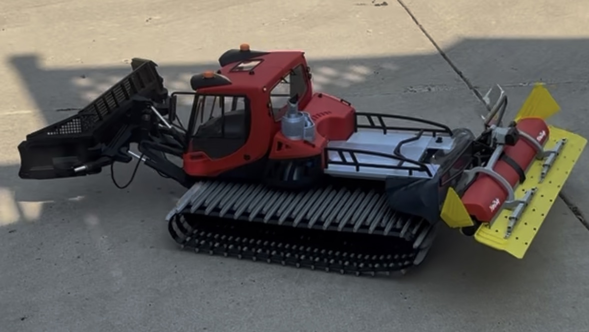
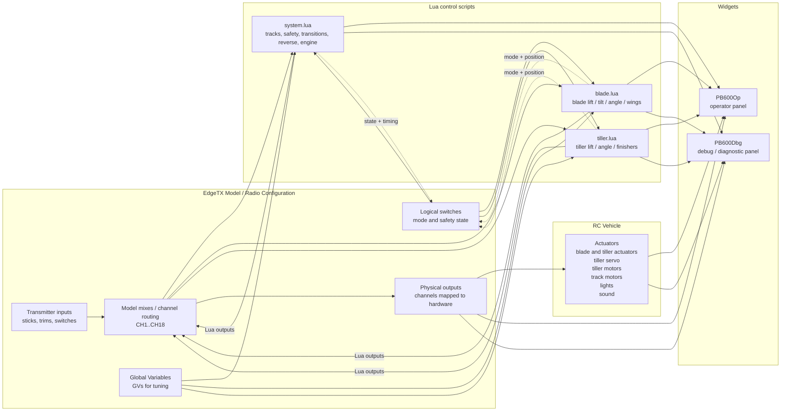
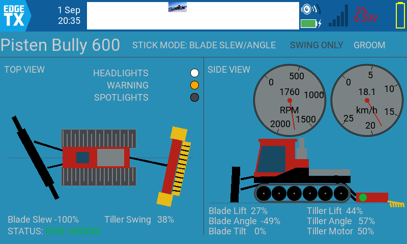
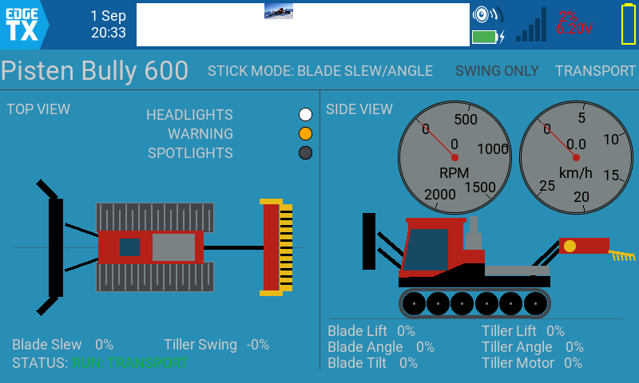
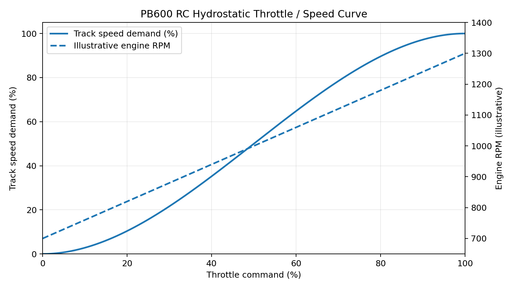
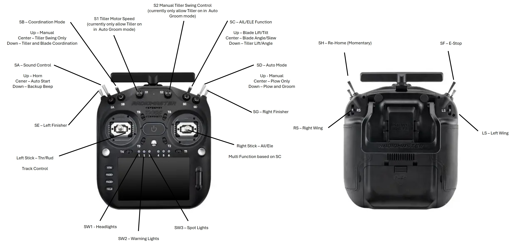

# PistenBully 600 RC Control System



*Pistenbully 600 1:7 Scale RC* 

Custom EdgeTX Lua mixer scripts and radio configuration for a scale RC
PistenBully 600 snowcat.

The project provides coordinated control of the tracks, front blade,
rear tiller, finishers, and tiller rotor while reproducing several
behaviors of the full-size PistenBully.

The control system is designed for a RadioMaster TX16S MK3 running
EdgeTX.



At a high level, the radio model collects pilot inputs and routes them
through the configured mixes. Those values feed the Lua scripts, which use
Global Variables and logical switches to compute the machine state and output
commands. The Lua scripts then write their computed outputs back into the
model mixes, where those values are assigned to the physical channels. The
related actuators then move the hardware, and the operator/debug widgets read
that same state to visualize the machine without creating a second control path.

------------------------------------------------------------------------

## Table of Contents

- [Overview](#overview)
- [Operator and Debug Panels](#operator-and-debug-panels)
  - [Operator Panel](#operator-panel)
  - [Debug Panel](#debug-panel)
  - [Current Model Channel Map](#current-model-channel-map)
- [Operating Modes](#operating-modes)
  - [Automatic Blade Transition](#automatic-blade-transition)
- [Track Control](#track-control)
  - [Features](#features)
- [Hydrostatic Drive Simulation](#hydrostatic-drive-simulation)
  - [Acceleration](#acceleration)
  - [Hydrostatic braking](#hydrostatic-braking)
  - [Direction changes](#direction-changes)
  - [Steering](#steering)
  - [Hydrostatic Acceleration Curve](#hydrostatic-acceleration-curve)
    - [RPM / Speed Curve](#rpm--speed-curve)
    - [Operating Characteristics](#operating-characteristics)
- [DasMikro TBS Mini Sound System](#dasmikro-tbs-mini-sound-system)
  - [Prop1 - Engine / Drivetrain Sound](#prop1---engine--drivetrain-sound)
  - [Prop2 - Horn / Reverse Warning](#prop2---horn--reverse-warning)
  - [Automatic Reverse Beeper](#automatic-reverse-beeper)
    - [L08 - Reverse Detection](#l08---reverse-detection)
    - [L09 - Reverse Beeper Timer](#l09---reverse-beeper-timer)
  - [Prop3 - Engine Autostart](#prop3---engine-autostart)
  - [Sound-System Signal Architecture](#sound-system-signal-architecture)
    - [Receiver Connections](#receiver-connections)
- [Automatic Reverse / Blade and Tiller Lift](#automatic-reverse--blade-and-tiller-lift)
- [Tiller Motor Safety](#tiller-motor-safety)
- [Emergency Stop](#emergency-stop)
- [Blade Control](#blade-control)
  - [Blade Reverse Clearance](#blade-reverse-clearance)
- [Manual Blade Controls](#manual-blade-controls)
- [Automatic Blade Positioning](#automatic-blade-positioning)
- [Blade Coordination](#blade-coordination)
  - [Coordination Rudder Deadband](#coordination-rudder-deadband)
- [Tiller Control](#tiller-control)
- [Tiller Coordination](#tiller-coordination)
- [Global Variables](#global-variables)
  - [Reverse Lift Scaling](#reverse-lift-scaling)
- [Lua Output Allocation](#lua-output-allocation)
  - [`blade.lua`](#bladelua)
  - [`tiller.lua`](#tillerlua)
  - [`system.lua`](#systemlua)
- [Transition States](#transition-states)
  - [Reading Logical Switches from Lua](#reading-logical-switches-from-lua)
- [Logical Switch Philosophy](#logical-switch-philosophy)
- [Actuator Calibration](#actuator-calibration)
  - [Asymmetric Lift Timing](#asymmetric-lift-timing)
  - [Blade Timing](#blade-timing)
  - [Tiller Timing](#tiller-timing)
  - [Reverse Clearance Timing](#reverse-clearance-timing)
  - [Position Model Synchronization](#position-model-synchronization)
  - [Transmitter Calibration](#transmitter-calibration)
  - [Receiver Failsafe](#receiver-failsafe)
- [Design Principles](#design-principles)
  - [One owner for each physical function](#one-owner-for-each-physical-function)
  - [Hardware outputs are valuable](#hardware-outputs-are-valuable)
  - [GVs are for live tuning](#gvs-are-for-live-tuning)
  - [Safety logic stays simple](#safety-logic-stays-simple)
  - [Automatic behavior has one authority](#automatic-behavior-has-one-authority)
  - [Preserve spare capacity](#preserve-spare-capacity)
- [Repository Structure](#repository-structure)
- [Development and Deployment](#development-and-deployment)
- [Current Development Status](#current-development-status)
  - [Safety](#safety)
- [Appendix A: PB600 System Specifications](#appendix-a-pb600-system-specifications)
  - [1. Platform](#1-platform)
  - [2. Transmitter Input Assignments](#2-transmitter-input-assignments)
  - [3. Physical Channel Map](#3-physical-channel-map)
  - [4. Lua Output Allocation](#4-lua-output-allocation)
    - [system.lua](#systemlua)
    - [blade.lua](#bladelua)
    - [tiller.lua](#tillerlua)
  - [5. Implement Specifications](#5-implement-specifications)
    - [Blade](#blade)
    - [Tiller](#tiller)
  - [6. Position Model Ranges](#6-position-model-ranges)
  - [7. Mode Targets](#7-mode-targets)
    - [Blade Working Constants](#blade-working-constants)
    - [Automatic Blade Transition Axes](#automatic-blade-transition-axes)
  - [8. Global Variables](#8-global-variables)
  - [9. Coordination Parameters](#9-coordination-parameters)
  - [10. Track / Hydrostatic Parameters](#10-track--hydrostatic-parameters)
  - [11. Reverse Clearance Parameters](#11-reverse-clearance-parameters)
  - [12. Logical Switches](#12-logical-switches)
  - [13. Sound System Specifications](#13-sound-system-specifications)
    - [Prop2 Functions](#prop2-functions)
  - [14. Lighting Channels](#14-lighting-channels)
  - [15. Tiller Rotor Specification](#15-tiller-rotor-specification)
  - [16. Safety Specifications](#16-safety-specifications)
  - [17. Receiver / Signal Notes](#17-receiver-signal-notes)
  - [18. Configuration Ownership](#18-configuration-ownership)
    - [Candidate Shared Constants for Future Consolidation](#candidate-shared-constants-for-future-consolidation)

------------------------------------------------------------------------

## Overview

The PB600 uses three custom Lua mixer scripts:

  ---------------------------------------------------------------------
  Script                             Responsibility
  ---------------------------------- ----------------------------------
  `system.lua`                       Track drive, hydrostatic drive
                                     behavior, safety interlocks,
                                     transition states, reverse
                                     behavior, tiller motor control,
                                     and engine/sound-card drive signal

  `blade.lua`                        Front blade actuator control,
                                     positioning, manual operation,
                                     coordinated blade movement, and
                                     automatic reverse-clearance lift

  `tiller.lua`                       Rear tiller lift, angle,
                                     finishers, grooming position, and
                                     automatic reverse lift
  ---------------------------------------------------------------------

The scripts intentionally separate responsibilities:

-   `system.lua` controls machine-level behavior and safety.
-   `blade.lua` controls only blade hardware.
-   `tiller.lua` controls only rear implement positioning.
-   Lua outputs are reserved primarily for actual hardware control or
    important machine state.
-   Frequently adjusted settings are exposed as EdgeTX Global Variables.
-   Mechanical calibration and rarely changed tuning values remain
    constants in the Lua code.

------------------------------------------------------------------------

## Operator and Debug Panels

The project includes two EdgeTX widgets in the `widgets/` directory:

-   `PB600Op/main.lua` builds the operator display panel.
-   `PB600Dbg/main.lua` builds the diagnostic debug panel.

Both widgets are intentionally simple EdgeTX Lua widgets: they draw to the
radio screen using `lcd.drawText()`, `lcd.drawLine()`, and geometry-based
vector drawing rather than a complicated UI framework. The widgets are
not independent controllers; they are visualization layers over the same
low-level Lua output values, Global Variables, and transmitter inputs that
`system.lua`, `blade.lua`, and `tiller.lua` already compute.

### Operator Panel

The operator panel is designed to look like a simplified machine display
for a snowcat operator rather than a raw telemetry dump. It draws a stylized
PB600-like top view and side view with animated track grousers, blade wings,
rear tiller, finishers, and a machine body silhouette. The widget uses a set
of calibration constants to model mechanical travel and animation timing,
including blade lift angle, tiller angle, wing travel, and track animation
speed.

The operator widget is built around several visual layers:

-   Top view: animated tracks, blade wings, tiller comb, finishers, and
    blade/slew motion.
-   Side view: chassis, wheels, cab, blade lift and angle, tiller lift and
    angle, and the tiller motor state.
-   Gauges: tachometer and speedometer style readouts for the simulated
    drivetrain.
-   State overlays: warnings or mode indicators showing when the machine is
    in a transition, reverse, or emergency-stop state.

The widget reads actuator and machine values from the Lua mixer outputs and
translates them into a visual machine posture. In other words, it is a real-
time representation of the modeled PB600 state rather than a separate logic
system.



*Example of Operator Panel in Groom Auto Mode*



*Example of Operator Panel in Transport Mode*

### Debug Panel

The debug panel is the engineering view. It is built as a compact, readout-
style dashboard that presents the primary control inputs, logical switch
states, output values, blade/tiller state, and the active Global Variables.

The layout is organized into columns for:

-   Inputs: throttle, rudder, elevator, aileron, trim and other stick values.
-   Switches: SA, SB, SC, SD, and emergency-stop status.
-   Logic: relevant logical-switch values such as the reverse and
    transition states.
-   System outputs: TrackL, TrackR, TMotor, TranB, TranT, and Engine.
-   Blade outputs: Lift, Tilt, Angle, Slew, LW, RW.
-   Tiller outputs: TAng, TLift, FinL, FinR.
-   Channel values and Global Variables for live tuning and diagnosis.

This panel is designed for setup, calibration, and troubleshooting. It lets
an operator or tuner confirm that the correct Lua outputs are moving, the
switch logic is evaluating as expected, and the commanded actuator values
match the physical machine state during testing.

In practice, the operator widget is the user-facing machine display, while the
debug widget is the system-level diagnostic surface used during tuning and
fault isolation.

### Current Model Channel Map

The actual EdgeTX model, defined in `models/model5.yml`, routes the Lua output
values onto the physical transmitter channels. The model is the live
configuration source for the radio, while the Lua scripts define what each
output is computing.

The following list is the readable version of the live model wiring:

| CH | Source in model | Lua Output | Used for / returned value |
|---|---|---|---|
| CH1 | `lua(2,1)` | `System:TrackL` | Left track drive command. Returns the hydrostatically smoothed left-track output for acceleration, braking, and steering. |
| CH2 | `lua(0,0)` | `Blade:Lift` | Blade lift actuator. Returns the modeled blade lift target, including transport/plow/groom target tracking and reverse-clearance motion. |
| CH3 | `lua(2,0)` | `System:TrackR` | Right track drive command. Returns the smoothed right-track output with the physical right-side inversion applied. |
| CH4 | `lua(0,1)` | `Blade:Tilt` | Blade tilt actuator. Returns the current blade tilt command for manual or coordinated tilt movement. |
| CH5 | `lua(0,4)` | `Blade:LW` | Left blade wing actuator. Returns the left wing position with the physical direction corrected by the model. |
| CH6 | `!lua(0,5)` | `Blade:RW` | Right blade wing actuator. Returns the right wing position, but inverted so the physical wing moves in the correct direction. |
| CH7 | `lua(1,2)` | `Tiller:FinL` | Left finisher output. Returns the left finisher position and timing during manual or automatic movement. |
| CH8 | `lua(1,3)` | `Tiller:FinR` | Right finisher output. Returns the right finisher position and timing during manual or automatic movement. |
| CH9 | `P2` + `lua(1,4)` | `Tiller:Swing` / auxiliary mixer | Tiller swing or auxiliary output. This channel is mixed from the radio swing source and a Lua override depending on SB state. |
| CH10 | `lua(0,2)` | `Blade:Angle` | Blade angle actuator. Returns the commanded blade angle target for mode transitions and manual positioning. |
| CH11 | `lua(0,3)` | `Blade:Slew` | Blade slew actuator. Returns the lateral blade slew command for manual or coordinated slew behavior. |
| CH12 | `lua(1,1)` | `Tiller:TAng` | Tiller angle actuator. Returns the current tiller angle target, including coordination effects. |
| CH13 | `lua(1,0)` | `Tiller:TLift` | Tiller lift actuator. Returns the modeled tiller lift target for transport, groom, and reverse-clearance positions. |
| CH14 | `I9` + `L10` override | `S2 / swing servo` | Tiller swing servo input channel. This is not a direct Lua output; it is the physical swing channel driven by the radio input with logic override. |
| CH15 | `lua(2,5)` | `System:EngOut` | Engine / drivetrain sound output. Returns the effective engine signal derived from actual track output, weighted toward the most loaded side. |
| CH16 | `SA` + `L9` override | `Sound Aux` | Auxiliary sound channel. Used for horn and reverse warning logic via SA and the reverse timer state. |
| CH17 | `SW1` | `Lighting:Headlights` | Headlight output. |
| CH18 | `SW2` | `Lighting:Warning` | Warning-light output. |
| CH19 | `SW3` | `Lighting:Spots` | Spot-light output. |

A few outputs are internal machine-state signals rather than physical actuator
channels:

-   `System:TMotor` is the tiller motor safety interlock and is used to permit
    or lock out rotor operation.
-   `System:TranB` and `System:TranT` are transition-state outputs that report
    whether the blade or tiller is in an automatic movement cycle.
-   `System:EngOut` is the signal that drives the sound module rather than raw
    throttle-stick position.

The practical reading is: the Lua scripts generate the machine behavior, and the
model file maps those outputs to the actual physical transmitter channels and
auxiliary logic.

------------------------------------------------------------------------

## Operating Modes

The `SD` three-position switch selects the primary operating mode.

  -----------------------------------------------------------------------
  SD Position             Mode                    Behavior
  ----------------------- ----------------------- -----------------------
  Up                      Transport               Blade and tiller move
                                                  to transport positions

  Middle                  Plow                    Blade moves to working
                                                  position; tiller
                                                  remains raised

  Down                    Groom                   Blade remains at
                                                  working position and
                                                  tiller lowers to its
                                                  Groom position
  -----------------------------------------------------------------------

Each Lua script reads `SD` directly. No Lua output is consumed simply to
communicate the current operating mode.

## Automatic Blade Transition

When entering or leaving Transport, the blade automatically moves only:

-   Blade Lift
-   Blade Angle
-   Left Wing
-   Right Wing

Blade Tilt and Blade Slew do **not** participate in automatic mode
transitions. Tilt and Slew remain under manual control and, when
enabled, coordinated-turn control.

Plow and Groom use the same normal blade working configuration, so
changing between Plow and Groom does not reposition the blade solely
because of the mode change.

------------------------------------------------------------------------

## Track Control

Track drive is generated entirely by `system.lua`.

The script accepts throttle and rudder inputs and generates independent
left and right track outputs.

## Features

-   Differential track steering
-   Pivot/drive blending
-   Nonlinear rudder response
-   Reduced steering sensitivity at higher speeds
-   Hydrostatic-style acceleration
-   Hydrostatic-style deceleration/braking
-   Increased braking when changing direction
-   Reduced track power while implements are transitioning
-   Automatic Groom reverse protection
-   Emergency stop

Raw throttle and rudder mixes should **not** also be applied to the
physical track channels.

Example:

``` text
CH1 - Left Track
  100% LUA:System:TrackL

CH3 - Right Track
  100% LUA:System:TrackR
```

The Lua track outputs are the sole authority for the track ESCs.

------------------------------------------------------------------------

## Hydrostatic Drive Simulation

The track control attempts to reproduce the heavy, progressive feel of
the PB600 hydrostatic drivetrain rather than directly mapping stick
position to ESC output.

The primary tuning constants are maintained in `system.lua`:

``` lua
local TURN_GAIN     = 0.25
local SPEED_FACTOR  = 0.60

local ACCEL_RATE    = 205
local DECEL_RATE    = 512
local REVERSE_BOOST = 250
```

These values are intentionally stored in code rather than Global
Variables because they represent machine calibration rather than normal
operator adjustments.

### Acceleration

Track output builds progressively toward the commanded speed.

The current target behavior is approximately five seconds to build from
zero to full commanded power.

### Hydrostatic braking

Reducing throttle causes the tracks to decelerate more aggressively than
they accelerate, simulating the braking effect of a hydrostatic
drivetrain.

The current target behavior is approximately two seconds from full power
to zero.

### Direction changes

Changing directly between forward and reverse applies additional braking
while passing through zero.

### Steering

Steering response is nonlinear near stick center and progressively
increases with rudder input.

Steering authority is also reduced as vehicle speed increases.

Hydrostatic Throttle and Track-Speed Model

The PB600 track controller models the behavior of a hydrostatic
drivetrain rather than mapping throttle position directly to track
speed. The controller separates three concepts:

Throttle demand → requested track speed → hydrostatically smoothed
actual track output.

This provides finer low-speed maneuvering, stronger response through the
middle of the throttle range, and a progressive approach to maximum
track speed.

Throttle-to-Speed Curve

Raw throttle is normalized to a range of -1.0 to +1.0. The magnitude
is converted to requested track speed using a smoothstep function:

S(x) = 3x² - 2x³

where:

x = absolute throttle position from 0.0--1.0

S(x) = requested track-speed fraction

throttle direction is reapplied after calculating the curve

The implementation is:

local function throttleToSpeedDemand(throttle)

  local sign =
    throttle < 0
      and -1
      or 1

  local x =
    clamp(
      math.abs(throttle),
      0,
      1
    )

  local shaped =
    x * x *
    (
      3 -
      2 * x
    )

  return
    shaped *
    sign

end

Throttle   Track-speed demand

      0%                 0.0%
     10%                 2.8%
     20%                10.4%
     30%                21.6%
     40%                35.2%
     50%                50.0%
     60%                64.8%
     70%                78.4%
     80%                89.6%
     90%                97.2%
    100%               100.0%

The result is intentionally nonlinear. Below 50% throttle, track-speed
demand is lower than stick position, providing finer control for
grooming and maneuvering. Above 50%, the curve becomes progressively
stronger before tapering as maximum speed is approached.

### Hydrostatic Acceleration Curve

Requested track speed is not sent directly to the track ESCs. Actual
track output is time-smoothed to simulate the progressive response of a
hydrostatic drivetrain.

The acceleration-rate multiplier is:

M(p) = 0.60 + 0.80[4p(1-p)]

where p is progress toward the requested track output.

With the base acceleration rate:

local ACCEL_RATE =
  191

the approximate acceleration rates are:

Acceleration phase      Effective rate

Initial launch         ~115 units/sec
25% progress           ~230 units/sec
50% progress           ~267 units/sec
75% progress           ~230 units/sec
Near full speed        ~115 units/sec

This produces an S-shaped acceleration response: gentle initial
movement, stronger acceleration through the middle of the range, and a
progressive taper as requested track speed is approached.

A full 0 → 100% track acceleration remains approximately 5
seconds.

Hydrostatic braking remains deliberately faster:

local DECEL_RATE =
  512

local REVERSE_BOOST =
  250

Reducing throttle therefore produces faster track deceleration than
applying power. A direction reversal adds an additional pressure-dump
effect while crossing zero.

RPM and Speed Relationship

The drivetrain model separates engine demand from vehicle speed. Vehicle
movement is based on the actual hydrostatically smoothed left and right
track outputs rather than directly on throttle position.

Conceptually:

```
Throttle
   │
   ▼
Engine / hydraulic demand
   │
   ▼
Throttle-to-speed S-curve
   │
   ▼
Requested track speed
   │
   ▼
Hydrostatic acceleration S-curve
   │
   ▼
Actual L/R track outputs
   │
   ├────► Vehicle speed estimate
   │
   └────► Engine/load output
```

The EngOut signal is derived from actual track outputs and is weighted
toward the most heavily driven track so steering-induced reduction of
one track does not unrealistically collapse the modeled engine/load
signal.

------------------------------------------------------------------------

### RPM / Speed Curve

The solid curve below is the implemented throttle-to-track-speed
relationship. The dashed RPM line illustrates the intended PB600-like
engine behavior, moving from approximately 700 RPM idle toward a roughly
1,300 RPM working region. The RPM line is illustrative documentation and
is not itself the current EngOut calculation.



*PB600 RC Hydrostatic Throttle and Speed Curve*

### Operating Characteristics

The important characteristic is that 50% throttle corresponds to 50%
requested track speed, while both ends of the throttle range are
softened.

At 20% throttle, the controller requests only about 10% track speed. At
80% throttle, it requests about 90%. This gives the RC PB600 precise
low-speed grooming control while retaining strong response in the upper
half of the throttle range.

------------------------------------------------------------------------

## DasMikro TBS Mini Sound System

The PB600 uses a DasMikro TBS Mini sound module for engine, drivetrain,
horn, and reverse-warning sounds.

The current receiver connections are:

``` text
Prop1 = CH15 - Engine / drivetrain
Prop2 = CH16 - Horn / reverse beeper
Prop3 = Not connected
```

Prop3 is not required because the sound module is configured for
automatic engine start.

------------------------------------------------------------------------

## Prop1 - Engine / Drivetrain Sound

TBS Mini Prop1 is connected to receiver CH15.

``` text
system.lua Engine
        |
        v
      CH15
        |
        v
 TBS Mini Prop1
```

CH15 is configured as:

``` text
100% LUA:System:Engine
```

The sound card previously received raw throttle on CH15.

The current configuration instead uses the `Engine` output generated by
`system.lua`. This allows engine RPM to follow effective hydrostatic
drivetrain activity rather than raw throttle-stick position.

During Groom reverse initiation, the tracks remain stopped while the
blade and tiller raise to their reverse-clearance positions. Because the
Engine signal is derived from the actual track outputs, the engine
remains near idle until reverse movement is permitted.

------------------------------------------------------------------------

## Prop2 - Horn / Reverse Warning

TBS Mini Prop2 is connected to receiver CH16.

The basic three-position control is SA:

``` text
SA Up       = Reverse warning beep
SA Middle   = No auxiliary sound
SA Down     = Horn
```

The horn is manually activated by moving SA Down.

------------------------------------------------------------------------

## Automatic Reverse Beeper

The reverse warning uses EdgeTX logical switches to periodically
activate the Prop2 beeper rather than playing a continuous warning.

### L08 - Reverse Detection

L08 detects a reverse throttle request:

``` text
L08
Function: a < x
V1: Thr
V2: -5
```

Conceptually:

``` text
Thr < -5
   |
   v
L08 = TRUE
```

This provides a small threshold around neutral so the reverse warning
does not activate from minor throttle-stick movement.

### L09 - Reverse Beeper Timer

L09 is a timer controlled by L08:

``` text
L09
Function: Timer
V1: 0.4
V2: 0.8
Switch: L08
```

When reverse is requested, L08 becomes true and enables L09.

CH16 uses this timer to repeatedly toggle the Prop2 command between the
neutral/middle command and the SA-Up beeper command:

``` text
SA Middle = No sound
SA Up     = Reverse beep
```

The resulting control sequence is:

``` text
Reverse requested
      |
      v
Thr < -5
      |
      v
L08 TRUE
      |
      v
L09 timer active
      |
      +---- repeating 0.4 / 0.8 sec cycle ----+
      |                                        |
      v                                        v
Middle command                            Up command
No sound                                  Reverse beep
      ^                                        |
      |                                        |
      +----------------------------------------+
```

The timer stops when throttle is no longer below -5.

The reverse beeper intentionally begins when reverse is requested, even
while the blade and tiller are completing their automatic
reverse-clearance lift.

------------------------------------------------------------------------

## Prop3 - Engine Autostart

TBS Mini Prop3 is not connected.

The sound module is configured to use automatic engine start based on
activity on Prop1.

``` text
TBS Prop3    = Not connected
Engine Start = Automatic
```

A separate receiver channel or switch for engine start/stop is therefore
not required.

------------------------------------------------------------------------

## Sound-System Signal Architecture

The complete control path is:

``` text
                    RadioMaster TX16S MK3
                             |
             +---------------+---------------+
             |                               |
             v                               v
      system.lua Engine                     SA
             |                               |
             v                               |
           CH15                    +----------+----------+
             |                     |          |          |
             v                    UP        MIDDLE      DOWN
      TBS Mini Prop1               |          |          |
             |                   BEEP        OFF        HORN
             |                     |
             |                     +---- L09 timer
             |                              ^
             |                              |
             |                         L08: Thr < -5
             |                              ^
             |                              |
             |                           Reverse
             |
             v
     Engine / Drivetrain
          Sound

      TBS Mini Prop3
             |
       Not connected
             |
      Engine autostart
```

### Receiver Connections

  ------------------------------------------------------------------------
  Receiver Channel Source                TBS Input        Function
  ---------------- --------------------- ---------------- ----------------
  CH15             `LUA:System:Engine`   Prop1            Engine /
                                                          drivetrain sound

  CH16             SA + L08/L09          Prop2            Horn / reverse
                   reverse-beeper logic                   warning

  None             None                  Prop3            Unused -
                                                          automatic engine
                                                          start
  ------------------------------------------------------------------------

------------------------------------------------------------------------

## Automatic Reverse / Blade and Tiller Lift

When operating in Groom mode, reverse is integrated with both the front
blade and rear tiller rather than simply being blocked.

The sequence is:

``` text
Reverse requested
       |
       v
Tiller rotor disabled
       |
       v
Reverse track output blocked
       |
       +------------------+
       |                  |
       v                  v
Blade raises          Tiller raises
by configured amount  by configured amount
       |                  |
       +--------+---------+
                |
                v
Both reverse-clearance lifts complete
                |
                v
Reverse track movement enabled
                |
                v
Snowcat backs with blade and tiller raised
                |
                v
Reverse command released
                |
       +--------+---------+
       |                  |
       v                  v
Blade returns         Tiller returns
to starting height    to starting height
       |                  |
       +--------+---------+
                |
                v
Both returns complete
                |
                v
Tiller rotor enabled
```

The base reverse lift amount is controlled by `GV4`.

Both the blade and tiller capture their exact lift position when the
reverse sequence begins. After reverse ends, each implement returns to
its captured pre-reverse position rather than simply returning to a
nominal GV-defined working position.

The tiller uses GV4 directly. The blade uses GV4 multiplied by the
code-level `BLADE_REVERSE_LIFT_FACTOR`. With the current factor of
`1.00`, both implements use the same reverse-lift percentage.

If reverse is released before either implement finishes raising, the
reverse-clearance lift is still completed before the implement returns
to its captured starting height.

This replaces the earlier design in which reverse was completely
prohibited in Groom unless the operator held the `SH` switch. `SH` is
therefore not required for normal reverse operation.

------------------------------------------------------------------------

## Tiller Motor Safety

`system.lua` provides a dedicated `TMotor` safety-interlock output.

``` text
TMotor = +1024 / +100%  -> Rotor operation permitted
TMotor = -1024 / -100%  -> Rotor forced OFF
```

The tiller motor ESC uses the following command convention:

``` text
-1024 / -100% =   0% motor power
    0 /    0% =  50% motor power
+1024 / +100% = 100% motor power
```

Therefore `TMotor = 0` must **not** be interpreted as motor OFF.

The normal rotor-speed command comes from `S1`. `TMotor` acts as a
safety override that forces the physical tiller motor channel to `-1024`
whenever rotor operation is prohibited.

The tiller rotor is disabled during:

-   Emergency stop
-   Automatic reverse lift
-   Reverse operation
-   Return from reverse to Groom position
-   Normal tiller transitions

The rotor is not permitted to restart until the tiller has completed its
return to the normal Groom position.

Conceptually:

``` text
Normal operation:
CH14 follows S1

Safety lockout:
CH14 forced to -1024
```

The receiver failsafe for the physical tiller motor channel must also be
configured for:

``` text
CH14 = -100% / -1024
```

Receiver `Hold` should **not** be used for the tiller motor channel.

------------------------------------------------------------------------

## Emergency Stop

`SF` is the machine emergency-stop switch.

E-stop is deliberately handled independently by each Lua script rather
than relying on one script to communicate the stop condition to the
others.

When E-stop is active:

### `system.lua`

-   Left track output = 0
-   Right track output = 0
-   Tiller motor disabled

### `blade.lua`

-   All blade actuator outputs stop

### `tiller.lua`

-   All tiller actuator outputs stop

This provides a simple and redundant safety architecture.

------------------------------------------------------------------------

## Blade Control

`blade.lua` directly controls all six blade functions.

  Lua Output   Function
  ------------ --------------------
  `Lift`       Blade lift
  `Tilt`       Blade tilt
  `Angle`      Blade angle
  `Slew`       Blade lateral slew
  `LW`         Left wing
  `RW`         Right wing

All six available Lua mixer outputs are therefore dedicated to physical
blade functions.

------------------------------------------------------------------------

## Blade Reverse Clearance

In Groom mode, blade lift participates in the automatic
reverse-clearance sequence.

When reverse is first requested, `blade.lua`:

1.  Captures the current modeled blade-lift position.
2.  Calculates a raised target using GV4 and
    `BLADE_REVERSE_LIFT_FACTOR`.
3.  Raises completely to that target.
4.  Holds the blade at the raised position while reverse remains active.
5.  Returns to the exact captured position after reverse is released.

If reverse is released before the blade has finished raising, the blade
still completes the full commanded reverse lift before returning to its
starting position.

During blade reverse lift, hold, and return:

-   Manual blade control is suppressed.
-   Blade coordination is suppressed.
-   Automatic reverse clearance has authority over blade Lift.

Normal blade control resumes after the reverse-return sequence
completes.

------------------------------------------------------------------------

## Manual Blade Controls

The right stick changes function according to the `SC` switch.

  SC Position   Aileron        Elevator
  ------------- -------------- -------------
  Up            Blade Tilt     Blade Lift
  Middle        Blade Slew     Blade Angle
  Down          Tiller Angle   Tiller Lift

Blade wings remain independently controlled by the left and right
sliders.

------------------------------------------------------------------------

## Automatic Blade Positioning

Automatic Transport / working-position transitions operate:

``` text
Lift
Angle
Left Wing
Right Wing
```

They do **not** automatically operate:

``` text
Tilt
Slew
```

  Axis         Transport -\> Plow/Groom   Plow/Groom -\> Transport
  ------------ -------------------------- ---------------------------
  Lift         Move down to GV2 depth     Raise to home
  Angle        Move to working angle      Return to transport angle
  Left Wing    Move to working opening    Close
  Right Wing   Move to working opening    Close
  Tilt         No automatic output        No automatic output
  Slew         No automatic output        No automatic output

`TranB` remains active until Lift, Angle, and Wings have completed their
automatic movement.

------------------------------------------------------------------------

## Blade Coordination

In Groom mode, rudder input can automatically coordinate blade movement
with vehicle turns.

Coordinated functions include:

-   Blade wings
-   Blade slew
-   Blade tilt
-   Blade angle

The relative amount of movement for each blade axis is stored as
constants in `blade.lua`.

For example:

``` lua
local COORD_WING_RANGE  = 0.15
local COORD_SLEW_RANGE  = 0.12
local COORD_TILT_RANGE  = 0.08
local COORD_ANGLE_RANGE = 0.10
```

A single Global Variable controls overall coordination intensity.

This replaces the older design that used individual GVs for each
coordinated blade axis.

The objective is to tune the relationship among the blade movements once
in code and expose only overall coordination strength to the operator.

## Coordination Rudder Deadband

Implement coordination uses a larger rudder deadband than track steering
so small incidental rudder movement while moving the combined
throttle/rudder stick does not cause blade or tiller movement.

Current starting values:

``` text
Track steering rudder deadband:   ~2%
Blade coordination deadband:      ~12%
```

In `blade.lua`:

``` lua
local COORD_RUD_DEADBAND = 0.12
```

The coordination input is rescaled outside the deadband so full physical
rudder still produces full configured coordination.

The larger coordination deadband affects implement coordination only and
does not reduce normal track-steering responsiveness.

------------------------------------------------------------------------

## Tiller Control

`tiller.lua` controls four rear implement functions.

  Lua Output   Function
  ------------ ----------------
  `TAng`       Tiller angle
  `TLift`      Tiller lift
  `FinL`       Left finisher
  `FinR`       Right finisher

Two Lua output slots remain available for future functionality.

When entering Groom mode, the tiller automatically moves to the
configured Groom position.

When leaving Groom, the tiller returns to its raised position.

------------------------------------------------------------------------

## Tiller Coordination

When coordination is enabled in Groom mode, rudder input can
automatically adjust tiller angle to follow the vehicle through a turn.

Overall coordination strength uses the same `GV1` master coordination
setting used by the blade.

This keeps blade and tiller coordination synchronized through a single
operator adjustment.

------------------------------------------------------------------------

## Global Variables

Global Variables are reserved for settings that are useful to adjust
live from the transmitter.

  ------------------------------------------------------------------------
  GV          Setting        Range       Current     Purpose
  ----------- -------------- ----------- ----------- ---------------------
  GV1         Coordination   0-100       60          Overall strength of
              Intensity                              automatic
                                                     blade/tiller
                                                     coordination

  GV2         Blade Working  0-100       40          Blade operating
              Depth                                  height/depth

  GV3         Tiller Groom   0-100       35          Normal tiller
              Depth                                  grooming height/depth

  GV4         Reverse Lift   0-100       10          Base amount the blade
              Height                                 and tiller raise for
                                                     reverse clearance

  GV5         Tiller Working 0-100       50          Normal tiller working
              Angle                                  angle

  GV6-GV9     Reserved                               Available for future
                                                     operator-adjustable
                                                     settings
  ------------------------------------------------------------------------

## Reverse Lift Scaling

`GV4` is the common operator adjustment for reverse-clearance lift.

The tiller uses GV4 directly. The blade uses GV4 multiplied by a
code-level scaling factor:

``` lua
local BLADE_REVERSE_LIFT_FACTOR = 1.00
```

With `GV4 = 10%` and a blade factor of `1.00`, both blade and tiller
raise approximately 10% of full lift travel.

The blade factor can be changed in code if the blade requires a
different amount of reverse clearance without consuming another Global
Variable.

Mechanical timing, actuator direction, steering characteristics,
deadbands, and other machine calibration values are maintained directly
in the Lua source.

------------------------------------------------------------------------

## Lua Output Allocation

EdgeTX custom Lua mixer scripts are limited to six outputs per script.

The project deliberately manages those outputs as follows.

## `blade.lua`

``` text
1  Lift
2  Tilt
3  Angle
4  Slew
5  LW
6  RW
```

**6 of 6 outputs used**

## `tiller.lua`

``` text
1  TAng
2  TLift
3  FinL
4  FinR
5  Swing
6  Reserved
```

**5 of 6 outputs used**

One Lua output slot remains available in `tiller.lua`.

## `system.lua`

``` text
1  TrackL
2  TrackR
3  TMotor
4  TranB
5  TranT
6  Engine
```

**6 of 6 outputs used**

`TranB` and `TranT` are consumed locally by EdgeTX logical switches and
do not require physical receiver channels.

`Engine` is mapped to the sound-card throttle input and represents
effective drivetrain output rather than raw throttle-stick position.

One Lua output slot remains available in `tiller.lua`.

------------------------------------------------------------------------

## Transition States

`system.lua` exposes two transition-state outputs:

``` text
TranB = Blade transition state
TranT = Tiller transition state
```

The outputs use:

``` text
+1024 = Transition active
-1024 = Transition inactive
```

These signals do **not** need to be assigned to physical receiver
channels.

EdgeTX logical switches consume the Lua outputs directly:

``` text
L11 = TranB active
L12 = TranT active
```

The logical switches should test whether the corresponding Lua output is
greater than zero.

The operator widget can then use L11 and L12 for transition and status
messaging without consuming physical receiver channels.

## Reading Logical Switches from Lua

`getLogicalSwitchValue()` uses a **zero-based** index and returns a Lua
boolean.

``` lua
local bladeTransition = getLogicalSwitchValue(10)   -- L11
local tillerTransition = getLogicalSwitchValue(11)  -- L12
```

``` text
Index 0  = L01
Index 1  = L02
...
Index 10 = L11
Index 11 = L12
```

Use the boolean directly:

``` lua
if getLogicalSwitchValue(10) then
    -- Blade transition active
end
```

Do not compare `getLogicalSwitchValue()` to `1024`.

------------------------------------------------------------------------

## Logical Switch Philosophy

Machine-control logic is kept primarily in Lua.

Logical switches should be used for radio-level functions such as:

-   Operator display indicators
-   Audio announcements
-   Warnings
-   Debugging
-   Special functions

Suggested logical states include:

``` text
E-stop Active
Any Transition Active
Groom Mode
Reverse Requested
Tiller Motor Locked
```

Safety-critical behavior should not depend on a long chain of EdgeTX
logical switches when Lua can directly read the underlying physical
switch or control.

Current transmitter-local transition assignments are:

``` text
L11 = Blade Transition (`TranB`)
L12 = Tiller Transition (`TranT`)
```

This avoids consuming physical receiver channels solely for status
information.

------------------------------------------------------------------------

## Actuator Calibration

Mechanical characteristics that normally remain constant are stored near
the beginning of each Lua script.

## Asymmetric Lift Timing

Lift actuator movement is asymmetric. The measured tiller full-stroke
travel is:

``` text
Full stroke DOWN = 11.0 seconds
Full stroke UP   = 17.0 seconds
```

The tiller was used as the initial calibration proxy for blade lift
movement. Testing showed that the upward proportional runtime required
additional compensation to return consistently to the original physical
position.

The current calibrated lift timing used by `blade.lua`, `tiller.lua`,
and `system.lua` is:

``` lua
local LIFT_DOWN_FULL_TIME = 11.0
local LIFT_UP_FULL_TIME   = 17.0
```

or the equivalent script-specific constant names.

## Blade Timing

Current blade working depth:

``` text
GV2 = 40%

Transport -> Working: 11.0 x 0.40 = 4.40 seconds DOWN
Working -> Transport: 17.0 x 0.40 = 6.80 seconds UP
```

## Tiller Timing

Current Groom depth:

``` text
GV3 = 35%

Raised -> Groom: 11.0 x 0.35 = 3.85 seconds DOWN
Groom -> Raised: 17.0 x 0.35 = 5.95 seconds UP
```

## Reverse Clearance Timing

Reverse is not permitted in Groom until both the blade and tiller have
completed their required reverse-clearance lift.

`system.lua` calculates the required lift time for each implement and
waits for the slower movement.

With the current settings:

``` text
GV4 = 10%
Blade Reverse Lift Factor = 1.00
Blade full-stroke UP  = 17.0 seconds
Tiller full-stroke UP = 17.0 seconds
```

the reverse lift times are:

``` text
Blade:   17.0 x 10% = 1.70 seconds UP
Tiller:  17.0 x 10% = 1.70 seconds UP

Reverse clearance time:
max(1.70, 1.70) = 1.70 seconds
```

When reverse is released, both implements return toward their exact
captured pre-reverse positions. With the current 11-second full-stroke
downward calibration, a 10% return movement is approximately:

``` text
11.0 x 10% = 1.10 seconds DOWN
```

The system waits for the slower required return before the reverse cycle
is considered complete.

## Position Model Synchronization

`blade.lua`, `tiller.lua`, and `system.lua` must use matching lift
calibration values. `system.lua` relies on these same values for
transition timing, reverse-clearance timing, and tiller-motor lockout
timing.

Using one symmetric travel time for both directions causes the modeled
actuator position to drift from the physical actuator after repeated
transitions.

Operator-facing GVs should not be used to compensate for incorrect
mechanical calibration.

## Transmitter Calibration

Physical stick calibration should be verified before compensating for
center errors in Lua. A miscalibrated rudder center can cause neutral
rudder to be interpreted as a pivot request.

After calibration, verify approximately:

``` text
Centered throttle = 0
Centered rudder   = 0
```

Software deadbands should handle normal small stick movement, not
compensate for a badly calibrated transmitter.

## Receiver Failsafe

Safety-critical channels should use explicit safe failsafe positions
rather than `Hold`. In particular:

``` text
Tiller Motor CH14 failsafe = -100% / -1024
```

Track channels should likewise be configured to their stopped values.

------------------------------------------------------------------------

## Design Principles

The project follows several rules intended to keep the radio
configuration maintainable.

### One owner for each physical function

A physical actuator should normally have one authoritative Lua output.

Avoid combining legacy radio mixes with Lua outputs for the same
actuator.

### Hardware outputs are valuable

Lua outputs are limited, so outputs should primarily be reserved for
physical hardware control or genuinely useful external machine states.

### GVs are for live tuning

If a parameter is routinely adjusted while operating the snowcat, it
belongs in a GV.

If it represents mechanical calibration or established machine behavior,
it belongs in code.

### Safety logic stays simple

E-stop is read directly by each relevant Lua script.

No script should depend on another Lua script's output to recognize the
E-stop.

### Automatic behavior has one authority

Reverse operation in Groom uses a coordinated blade/tiller
reverse-clearance sequence.

`system.lua` owns permission for track reverse and determines when
sufficient clearance time has elapsed. `blade.lua` owns physical blade
reverse-lift movement, while `tiller.lua` owns physical tiller
reverse-lift movement.

Both implement scripts capture their own starting positions and return
independently to those positions after reverse.

Older competing behaviors such as an SH reverse override should not be
layered on top of this behavior.

### Preserve spare capacity

Unused Lua outputs and GVs are intentionally left available rather than
consumed simply because they exist.

`blade.lua` and `system.lua` currently use all six available outputs.
The two remaining Lua output slots are in `tiller.lua`.

------------------------------------------------------------------------

## Current Development Status

The control system is undergoing a consolidation from several
generations of working PB600 scripts.

The current architecture is intended to become the new baseline:

-   Simplified GV allocation
-   GV2 Blade Working Depth = 40%
-   GV3 Tiller Groom Depth = 35%
-   GV4 Reverse Lift Height = 10%
-   Direct Lua hardware outputs
-   Preserved time-based hydrostatic track behavior
-   Approximately 5-second acceleration to full power
-   Approximately 2-second hydrostatic deceleration
-   Unified blade/tiller coordination
-   Blade coordination rudder deadband = approximately 12%
-   Automatic blade and tiller reverse-clearance lift
-   Reverse blocked until both implements reach clearance
-   Blade and tiller return to their captured pre-reverse heights
-   Tiller rotor safety interlock throughout reverse lift, reverse
    operation, and return
-   E-stop across tracks, tiller rotor, blade, and tiller actuators
-   Explicit Transport / Plow / Groom transitions
-   Logical switches used for transmitter-local status/UI functions
    rather than primary machine-control logic
-   L11/L12 provide Blade/Tiller transition status without consuming
    receiver channels
-   Direction-specific 11-second-down / 17-second-up lift timing
-   Blade automatic transitions limited to Lift, Angle, and Wings
-   Tilt and Slew excluded from automatic blade mode transitions
-   Receiver failsafe forces tiller rotor channel to -1024/off
-   Effective drivetrain `Engine` output replaces raw throttle for
    sound-card Prop1
-   `system.lua` uses all six Lua outputs
-   Two Lua output slots remain available in `tiller.lua`

New functionality should be evaluated against this architecture before
additional GVs, logical switches, or Lua outputs are allocated.

------------------------------------------------------------------------

## Repository Structure

A suggested repository structure is:

``` text
pb600-edgetx/
|
+-- README.md
|
+-- lua/
|   +-- blade.lua
|   +-- tiller.lua
|   +-- system.lua
|
+-- widgets/
|   +-- operator/
|   +-- debug/
|
+-- docs/
|   +-- channel-map.md
|   +-- gv-reference.md
|   +-- calibration.md
|
+-- deploy/
|   +-- deploy-test.ps1
|   +-- deploy-production.ps1
|
+-- .gitignore
```

The Git repository is the authoritative source for Lua scripts and
widget code.

Files should be edited and committed in the repository rather than
directly on the radio SD card.

------------------------------------------------------------------------

## Development and Deployment

Two deployment targets are used:

``` text
Test:
C:\radio

Production / Radio SD Card:
D:\
```

The intended workflow is:

``` text
Edit in VS Code
      |
      v
Test / Review
      |
      v
Commit to Git
      |
      v
Deploy to C:\radio
      |
      v
Test
      |
      v
Deploy approved version to D:\
```

Production deployment should copy only the files managed by the
repository into their appropriate EdgeTX SD-card directories rather than
treating the entire SD card as the Git working directory.

This keeps source control independent of the removable radio storage.

------------------------------------------------------------------------

## Safety

This is hobby RC control software.

Always test new Lua scripts with the model safely supported and, where
practical, with track drive and high-power accessories disconnected.

Verify actuator direction, travel limits, E-stop behavior, and automatic
transitions before operating the model under load.

------------------------------------------------------------------------

## Appendix A: PB600 System Specifications

This appendix consolidates the detailed quick-reference system notes that were
previously kept in a standalone specification document. The main README
presents the design narrative and architecture; this appendix is the compact
reference sheet for live configuration values, channel mapping, and
calibration constants.

### 1. Platform

  ---------------------------------------------------------------------
  Item                               Specification
  ---------------------------------- ----------------------------------
  Model                              PistenBully 600 scale snowcat

  Transmitter                        RadioMaster TX16S MK3

  Firmware                           EdgeTX

  Stick Mode                         Mode 2

  Physical channel capacity          32 channels with backpack receiver
                                     arrangement

  Custom mixer scripts               `system.lua`, `blade.lua`,
                                     `tiller.lua`

  Sound module                       DasMikro TBS Mini
  ---------------------------------------------------------------------

### 2. Transmitter Input Assignments

  Input       Assignment
  ----------- ----------------------------------------------------
  Thr         Track forward / reverse
  Rud         Track steering; blade/tiller coordination input
  AIL         Context-sensitive implement control selected by SC
  ELE         Context-sensitive implement control selected by SC
  SC Up       AIL = Blade Tilt; ELE = Blade Lift
  SC Middle   AIL = Blade Slew; ELE = Blade Angle
  SC Down     AIL = Tiller Angle; ELE = Tiller Lift
  SD Up       Transport
  SD Middle   Plow
  SD Down     Groom
  SB Up       Coordination enabled
  SF Up       E-stop
  LS          Left blade wing
  RS          Right blade wing
  SE          Left tiller finisher
  SG          Right tiller finisher
  S1          Tiller rotor speed
  S2          Tiller swing servo
  SA Up       Reverse beep
  SA Middle   No auxiliary sound
  SA Down     Horn

  

### 3. Physical Channel Map

    Channel Function                Source / Control
  --------- ----------------------- ---------------------------------
        CH1 Left Track              `LUA:System:TrackL`
        CH2 Blade Lift              `LUA:Blade:Lift`
        CH3 Right Track             `LUA:System:TrackR`
        CH4 Blade Tilt              `LUA:Blade:Tilt`
        CH5 Left Blade Wing         `LUA:Blade:LW`
        CH6 Right Blade Wing        `LUA:Blade:RW`
        CH7 Left Tiller Finisher    `LUA:Tiller:FinL`
        CH8 Right Tiller Finisher   `LUA:Tiller:FinR`
        CH9 Tiller Swing Servo      S2 / standard EdgeTX mix
       CH10 Blade Angle             `LUA:Blade:Angle`
       CH11 Blade Slew              `LUA:Blade:Slew`
       CH12 Tiller Lift             `LUA:Tiller:TLift`
       CH13 Tiller Angle            `LUA:Tiller:TAng`
       CH14 Tiller Rotor Motor      S1 gated by `LUA:System:TMotor`
       CH15 TBS Prop1 / Engine      `LUA:System:EngOut`
       CH16 TBS Prop2 / Aux Sound   SA + L08/L09
       CH17 Headlights              Lighting control
       CH18 Warning Lights          Lighting control
       CH19 Spot Lights             Lighting control

### 4. Lua Output Allocation

#### system.lua

    \# Output     Use
  ---- ---------- --------------------------------------------
     1 `TrackL`   Left track command
     2 `TrackR`   Right track command
     3 `TMotor`   Tiller rotor permission / lockout
     4 `TranB`    Blade transition state; transmitter-local
     5 `TranT`    Tiller transition state; transmitter-local
     6 `EngOut`   Effective drivetrain signal for sound card

#### blade.lua

    \# Output    Physical Function
  ---- --------- -------------------
     1 `Lift`    Blade lift
     2 `Tilt`    Blade tilt
     3 `Angle`   Blade angle
     4 `Slew`    Blade slew
     5 `LW`      Left wing
     6 `RW`      Right wing

#### tiller.lua

    \# Output    Physical Function
  ---- --------- -------------------
     1 `TAng`    Tiller angle
     2 `TLift`   Tiller lift
     3 `FinL`    Left finisher
     4 `FinR`    Right finisher

### 5. Implement Specifications

#### Blade

  -----------------------------------------------------------------------
  Function            Channel Manual          Full-Travel  Direction Sign
                              Input           Calibration 
  ----------- --------------- ----------- --------------- ---------------
  Lift                    CH2 SC Up + ELE   Down 11.0 s /              -1
                                                Up 17.0 s 

  Tilt                    CH4 SC Up + AIL           5.0 s              +1

  Angle                  CH10 SC Middle +           6.7 s              +1
                              ELE                         

  Slew                   CH11 SC Middle +           6.7 s              +1
                              AIL                         

  Left Wing               CH5 LS                   3.75 s              +1

  Right Wing              CH6 RS                   3.75 s              +1
  -----------------------------------------------------------------------

#### Tiller

  -----------------------------------------------------------------------
  Function            Channel Manual          Full-Travel  Direction Sign
                              Input           Calibration 
  ----------- --------------- ----------- --------------- ---------------
  Lift             Configured SC Down +     Down 11.0 s /              -1
                  tiller lift ELE               Up 17.0 s 
                      channel                             

  Angle                  CH13 SC Down +            3.75 s              +1
                              AIL                         

  Left                    CH7 SE                    2.0 s             ---
  Finisher                                                

  Right                   CH8 SG                    2.0 s             ---
  Finisher                                                

  Swing                   CH9 S2                    Servo             ---

  Rotor                  CH14 S1              ESC / motor             ---
                                               controller 
  -----------------------------------------------------------------------

### 6. Position Model Ranges

  Function        Minimum   Maximum Meaning
  ------------- --------- --------- -----------------------------
  Blade Lift           -1         0 -1 = full down; 0 = full up
  Blade Wings           0         1 0 = closed; 1 = fully open
  Tiller Lift          -1         0 -1 = full down; 0 = full up

**Wing position tracking must be clamped to `0..1`.**

### 7. Mode Targets

  -----------------------------------------------------------------------
  Mode              SD                Blade             Tiller
  ----------------- ----------------- ----------------- -----------------
  Transport         Up                Lift up; angle    Raised
                                      returned; wings   
                                      closed            

  Plow              Middle            Working           Raised
                                      depth/angle;      
                                      wings open        

  Groom             Down              Same normal blade Groom depth/angle
                                      working geometry  
                                      as Plow           
  -----------------------------------------------------------------------

#### Blade Working Constants

  Constant             Value
  ------------------ -------
  `WORK_WING_OPEN`      0.40
  `WORK_ANGLE`         -0.50
  Working Depth          GV2

#### Automatic Blade Transition Axes

  Axis         Automatic Transport ↔ Work
  ------------ ----------------------------
  Lift         Yes
  Angle        Yes
  Left Wing    Yes
  Right Wing   Yes
  Tilt         No
  Slew         No

### 8. Global Variables

     GV Parameter                     Starting Value
  ----- --------------------------- ----------------
    GV1 Coordination Intensity                   60%
    GV2 Blade Working Depth                      40%
    GV3 Tiller Groom Depth                       35%
    GV4 Blade/Tiller Reverse Lift                10%
    GV5 Tiller Working Angle                     50%
    GV6 Reserved                                 ---
    GV7 Reserved                                 ---
    GV8 Reserved                                 ---
    GV9 Reserved                                 ---

### 9. Coordination Parameters

  Parameter                            Value
  ---------------------------------- -------
  Blade/Tiller coordination master       GV1
  Implement rudder deadband             0.12
  Track rudder deadband                 0.02
  `COORD_WING_RANGE`                    0.15
  `COORD_SLEW_RANGE`                    0.12
  `COORD_TILT_RANGE`                    0.08
  `COORD_ANGLE_RANGE`                   0.10

Coordination is disabled during automatic mode transitions and
reverse-clearance movement.

### 10. Track / Hydrostatic Parameters

  Parameter             Value Function
  ------------------- ------- ----------------------------------------------
  `TURN_GAIN`            0.25 Base differential steering strength
  `SPEED_FACTOR`         0.60 Steering reduction as track speed increases
  `RUDDER_DEADBAND`      0.02 Track steering deadband
  `ACCEL_RATE`            205 Approx. 5 s zero-to-full acceleration
  `DECEL_RATE`            512 Approx. 2 s full-to-zero deceleration
  `REVERSE_BOOST`         250 Faster pressure dump during direction change

### 11. Reverse Clearance Parameters

  -----------------------------------------------------------------------
  Parameter                          Value / Source
  ---------------------------------- ------------------------------------
  Reverse lift amount                GV4

  Blade lift multiplier              `BLADE_REVERSE_LIFT_FACTOR = 1.00`

  Blade full UP time                 17.0 s

  Blade full DOWN time               11.0 s

  Tiller full UP time                17.0 s

  Tiller full DOWN time              11.0 s

  Reverse release condition          Slower of blade/tiller clearance
                                     times completed

  Return target                      Captured pre-reverse position for
                                     each implement

  Tiller rotor during reverse cycle  Locked out
  -----------------------------------------------------------------------

At GV4 = 10% and blade factor = 1.00:

  Movement                    Nominal Time
  ------------------------- --------------
  Blade reverse lift                1.70 s
  Tiller reverse lift               1.70 s
  Reverse clearance delay           1.70 s
  10% downward return             ~1.10 s

### 12. Logical Switches

  -----------------------------------------------------------------------
  Logical Switch          Configuration           Use
  ----------------------- ----------------------- -----------------------
  L08                     `Thr < -5`              Reverse requested

  L09                     Timer; V1 = 0.4, V2 =   Intermittent reverse
                          0.8; Switch = L08       beep

  L11                     System `TranB` state    Blade transition active

  L12                     System `TranT` state    Tiller transition
                                                  active
  -----------------------------------------------------------------------

Lua logical-switch indexes are zero-based:

```lua
getLogicalSwitchValue(10) -- L11
getLogicalSwitchValue(11) -- L12
```

Return type is boolean `true` / `false`.

### 13. Sound System Specifications

  Item           Specification
  -------------- --------------------------------------------
  Module         DasMikro TBS Mini
  Firmware       4.0.0.0
  Sound set      Pistenbully, Sound Library Update Oct 2020
  Prop1          CH15 / effective engine signal
  Prop2          CH16 / auxiliary sounds
  Prop3          Not connected
  Engine start   Automatic

#### Prop2 Functions

  SA Position / Logic   Sound
  --------------------- ----------------------------------------------------
  SA Up                 Reverse beep
  SA Middle             None
  SA Down               Horn
  L08 + L09             Toggles reverse-beep command at 0.4 / 0.8 s timing

### 14. Lighting Channels

    Channel Function
  --------- ----------------
       CH17 Headlights
       CH18 Warning lights

### 15. Tiller Rotor Specification

  Item                   Specification
  ---------------------- ----------------------
  Physical channel       CH14
  Operator input         S1
  Lua safety source      `System:TMotor`
  S1 = -1024             0% motor power
  S1 = 0                 ~50% motor power
  S1 = +1024             100% motor power
  Required OFF command   -1024
  Receiver failsafe      CH14 = -1024 / -100%

Because S1 zero represents approximately 50% motor power, the tiller
rotor cannot be safely disabled by multiplying the S1 command by zero.
The final channel command must be forced to `-1024`.

### 16. Safety Specifications

  -------------------------------------------------------------------------
  Condition     TrackL/R      Blade/Tiller   Tiller Rotor    Engine Output
                              Motion                         
  ------------- ------------- -------------- --------------- --------------
  Normal        Enabled       Enabled        S1-controlled   Effective
                                             when permitted  track average

  E-stop        0             Stopped        -1024 / OFF     0
  (`SF Up`)                                                  

  Reverse       0             Blade/tiller   OFF             Near idle
  clearance                   lift active                    

  Reverse       Reverse       Clearance      OFF             Follows
  backing       enabled       positions held                 effective
                                                             tracks

  Reverse       As system     Blade/tiller   OFF             Follows
  return        state permits returning                      effective
                                                             tracks
  -------------------------------------------------------------------------

### 17. Receiver / Signal Notes

  ---------------------------------------------------------------------
  Item                               Specification
  ---------------------------------- ----------------------------------
  Extended physical channels         Backpack arrangement provides
                                     access through CH32

  CH14 failsafe                      Must be explicitly set to -100%;
                                     do not use Hold

  CH17                               Headlights

  CH18                               Warning lights

  Transition state channels          Not physically assigned; use
                                     L11/L12 locally
  ---------------------------------------------------------------------

### 18. Configuration Ownership

  Parameter Type                Location
  ----------------------------- ----------------------------
  Live operator tuning          Global Variables
  Track behavior                `system.lua` constants
  Blade calibration             `blade.lua` constants
  Tiller calibration            `tiller.lua` constants
  Channel/mix assignments       EdgeTX model configuration
  Transition state conversion   Logical switches L11/L12
  Sound auxiliary sequencing    L08/L09 + CH16 mix

#### Candidate Shared Constants for Future Consolidation

```text
Blade/tiller lift travel times
Wing travel time
Coordination rudder deadband
Coordination ranges
Blade reverse-lift factor
Hydrostatic acceleration/deceleration rates
TURN_GAIN
SPEED_FACTOR
Reverse threshold
```

------------------------------------------------------------------------

This appendix is intended to be a compact reference companion to the main project narrative. The actual behavior still lives in the model YAML and Lua scripts, while the README and this appendix explain how those pieces fit together.

### Source-of-Truth Checklist

Use the following quick checks any time the model or scripts are changed:

- `models/model5.yml` is the live channel-routing source. If the channel map changes, update the README section on the current model channel map and the appendix channel table.
- `scripts/mixes/system.lua` owns track behavior, safety interlocks, transition-state outputs, reverse behavior, and the effective engine output.
- `scripts/mixes/blade.lua` owns blade lift, tilt, angle, slew, and wing positioning.
- `scripts/mixes/tiller.lua` owns tiller lift, angle, finishers, and the tiller swing coordination logic.
- `widgets/PB600Op/main.lua` and `widgets/PB600Dbg/main.lua` are visualization layers only; they should not be treated as independent controllers.
- Global Variables should be used for live tuning, not for fixed mechanical calibration values.
- Logical switches are primarily for radio-local status and UI functions; critical safety logic should remain in Lua.
- Any change to a Lua output count or a channel assignment should be verified against both the model YAML and the README output allocation tables.

This checklist keeps the project documentation aligned with the live implementation and prevents stale references after future calibration or model updates.
